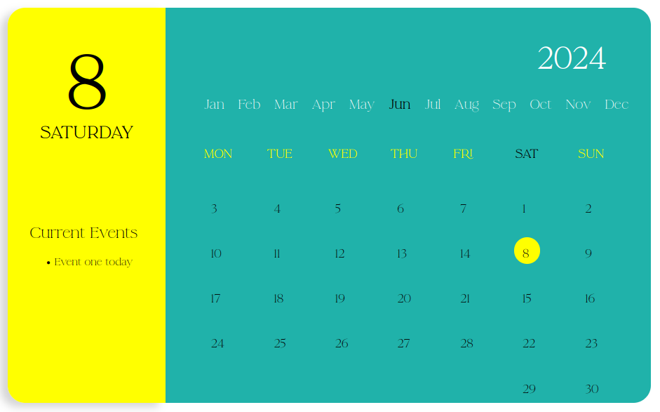
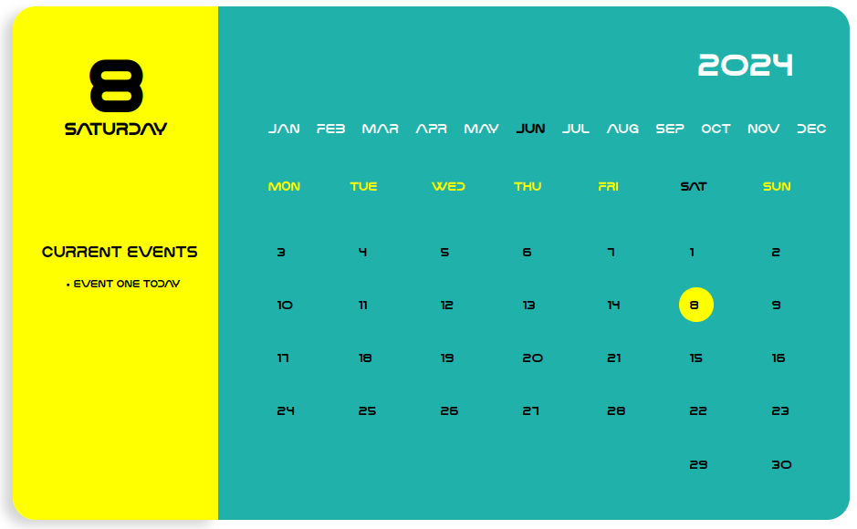

# NIB-DASH

An event calendar to be added to any html built with Jquery

## Why i made Nib Dashboard?
This project originated from a calender module i had to create for a dashboard, i thought why not make it accessible for any project?


### How to use:
##### clone repo

`` https://github.com/Bigizic/NIB-DASH.git ``

###### copy path to css and js file to html script

``<link rel="stylesheet" href="../css/calendar.css" type="text/css">``

``<script src="../js/dashboard.js" type="text/JavaScript"></script>``


###### In your js file make a call to the createCalendar() function

````js
$(document).ready(function() {
    let calendar = $('.dashboard_render').createCalendar()
});
````


###### To use the methods available like changing colors and adding event information:

````js
$(document).ready(function() {
    let calendar = $('.dashboard_render').createCalendar().data('createCalendar');
});
````


# Fonts Preview

| font name | image |
| ----- | ----- |
| Font 1 |  |
| Font 7 |  |


### Available methods and how to use

| method | details |
| ---- | ---- |
| setBackgroundColor() | sets background color |
| setLeftBackgroundColor() | sets background color for the left side bar |
| setCurrentDayColor() | sets background color for the current day |
| setEventText() | updates event text |
| setFontType() | updates the font for the whole text, accepts font1- font15 |


> [!NOTE]
> Example
````js
$(document).ready(function() {
let calendar = $('.dashboard_render').createCalendar().data('createCalendar');
calendar.setBackgroundColor('pink');
calendar.setLeftBackgroundColor('violet');
calendar.setCurrentDayColor('blue');
calendar.setEventText('Event five today'); // sets custom event
calendar.setFontType('font7');
});
````
<a href="./dashboard/js/render.js">as shown here</a>

